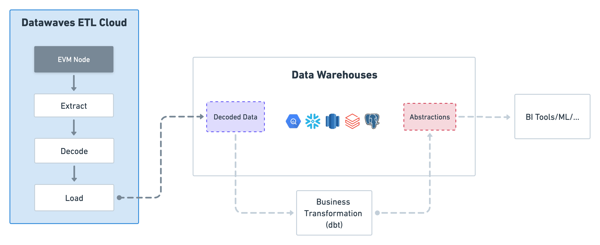

# dbt_datawaves


## What does this dbt package do?


This package models blockchain data from [Datawaves](https://datawaves.xyz/) and provides abstractions like smart contract activity and wallet profile. These abstractions can simplify the process of querying for data.


### Architecture



### Abstractions

#### Event Model

| **model**                                                                                                 | **description**                                                                 |
|-----------------------------------------------------------------------------------------------------------|---------------------------------------------------------------------------------|
| [nft_trades](https://github.com/datawaves-xyz/dbt_ethereum/blob/master/models/nft/nft_trades.sql) | Each record represents a trade in OpenSea/CryptoPunks, enriched with data about the trade. |
| [nft_mints](https://github.com/datawaves-xyz/dbt_ethereum/blob/master/models/nft/nft_mints.sql) | Each record represents an ERC721/ERC1155 token that has been minted |


#### Labels

| **model**                                                                                                 | **description**                                                                 |
|-----------------------------------------------------------------------------------------------------------|---------------------------------------------------------------------------------|
| [nft_whale](https://github.com/datawaves-xyz/dbt_ethereum/blob/master/models/labels/nft_whale.sql) | Wallets that hold large amounts of NFT value |
| [smart_nft_trader](https://github.com/datawaves-xyz/dbt_ethereum/blob/master/models/labels/smart_nft_trader.sql) | The top 100 addresses in terms of realized profits from NFT sales |
| [smart_nft_holder](https://github.com/datawaves-xyz/dbt_ethereum/blob/master/models/labels/smart_nft_holder.sql) |  |
| [smart_nft_sweeper](https://github.com/datawaves-xyz/dbt_ethereum/blob/master/models/labels/smart_nft_sweeper.sql) |  |


## How do I use this dbt package?

### Prerequisites

To use this dbt project, you must have the following:

* Use Datawaves ETL Cloud to sync data into your destination.
* A PostgreSQL, Databricks destination.

### Install the package

Include in your packages.yml:

```yml
packages:
  - git: "https://github.com/datawaves-xyz/dbt_datawaves"
    revision: "0.0.1"
```
